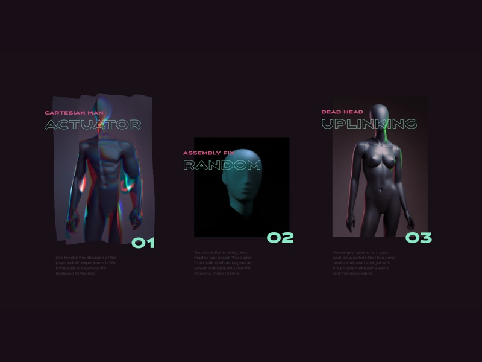

# Create a Wave Motion Effect on an Image with Three.js

*Learn how to make a wave motion effect on an image with Three.js.*



[Article on Codrops](https://tympanus.net/codrops/?p=)

[Demo](http://tympanus.net/Development/.../)

## Installation
Run this command in the terminal
```
npm install
```

Compile the code
```
npm run dev
```

Compile the code with a local server
```
npm run watch
```

## Credits

- [Behind the scenes of WeCargo](https://medium.com/epicagency/behind-the-scenes-of-we-cargo-3999f5f559c)
- [Three.js](https://threejs.org/docs/)
- [The Book of Shaders](https://www.npmjs.com/package/glsl-noise)
- [GLSL Noise](https://www.npmjs.com/package/glsl-noise)

## License
This resource can be used freely if integrated or build upon in personal or commercial projects such as websites, web apps and web templates intended for sale. It is not allowed to take the resource "as-is" and sell it, redistribute, re-publish it, or sell "pluginized" versions of it. Free plugins built using this resource should have a visible mention and link to the original work. Always consider the licenses of all included libraries, scripts and images used.

## Misc

Follow *@marioecg*: [Twitter](https://twitter.com/marioecg), [Instagram](https://www.instagram.com/marioecg/)

Follow Codrops: [Twitter](http://www.twitter.com/codrops), [Facebook](http://www.facebook.com/codrops), [GitHub](https://github.com/codrops), [Instagram](https://www.instagram.com/codropsss/)


[© Codrops 2019](http://www.codrops.com)


